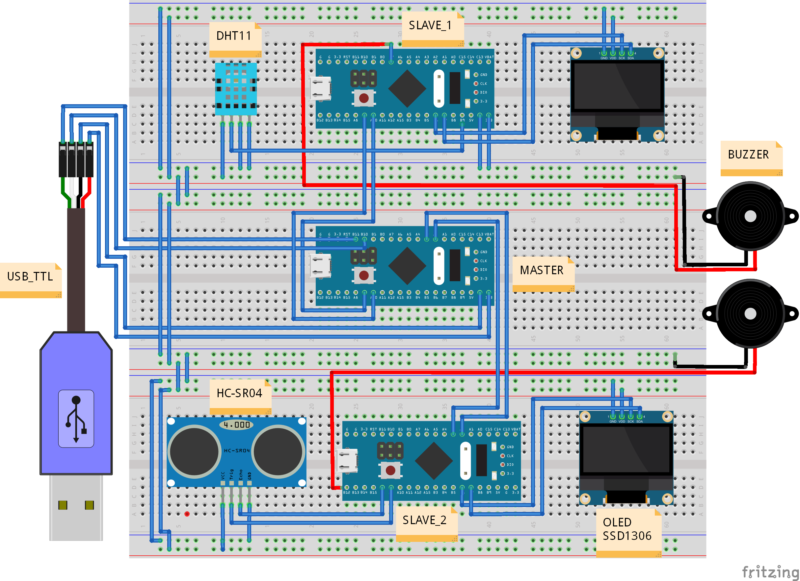
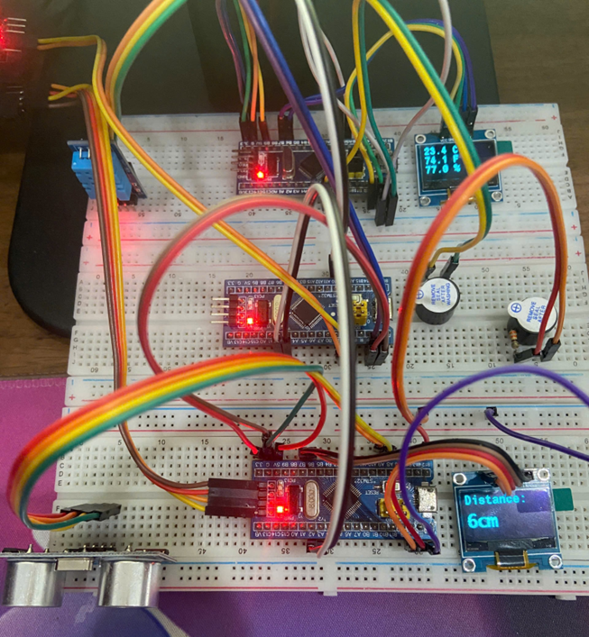
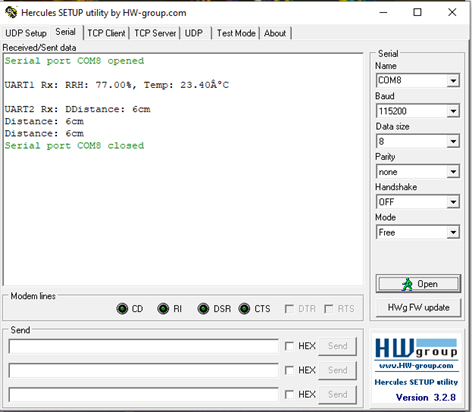

# IOT Greenhouse Seeding Machine

## Description

An intelligent IoT-based greenhouse monitoring and control system designed for automated seeding operations. This project utilizes STM32F103C8 microcontrollers to create a distributed sensor network that monitors environmental conditions critical for optimal plant growth and seeding.

### Key Features

- **Environmental Monitoring**: Real-time temperature and humidity tracking using DHT11 sensors
- **Distance Measurement**: Ultrasonic HC-SR04 sensors for precise distance monitoring
- **Visual Display**: SSD1306 OLED display for real-time data visualization
- **Master-Slave Architecture**: Distributed system with master controller coordinating multiple sensor nodes
- **UART Communication**: Inter-module communication for centralized monitoring and control

### System Components

1. **DHT11 Module**: Temperature and humidity sensing unit with OLED display
2. **HCSR04 Module**: Ultrasonic distance sensor for level/position monitoring
3. **HCSR04_OLED Module**: Distance sensor with integrated OLED display
4. **Master Controller**: Central processing unit that receives and processes data from all sensor nodes
5. **MASTER_LAST**: Enhanced master controller with additional features

### Hardware Components

- **Microcontroller**: STM32F103C8TX (ARM Cortex-M3)
- **Temperature/Humidity Sensor**: DHT11
- **Distance Sensor**: HC-SR04 Ultrasonic sensor
- **Display**: SSD1306 OLED (I2C interface)
- **Communication**: UART serial communication

## System Images

### Circuit Simulation
Circuit schematic designed using Fritzing:


*STM32F103C8T6 with DHT11 and HC-SR04 sensor connections*

### Real Hardware Implementation
Actual circuit implementation:


*Physical setup of the greenhouse monitoring system*

### Data Output
Serial data export from the system using Hercules terminal:


*Real-time sensor data streaming via UART communication*

### Technology Stack

- **Development Environment**: STM32CubeIDE
- **HAL Library**: STM32F1xx HAL Driver
- **Programming Language**: C
- **Build System**: Make

## Authors

- **Project Owner**: Trịnh Công Thành

## Usage

### Prerequisites

- STM32CubeIDE or compatible ARM toolchain
- ST-Link programmer/debugger
- STM32F103C8 development boards (Blue Pill or equivalent)
- Required sensors: DHT11, HC-SR04
- SSD1306 OLED display
- USB to UART converter (for debugging and inter-module communication)

### Hardware Setup

1. **DHT11 Module**:
   - Connect DHT11 data pin to GPIOB Pin 9
   - Connect I2C OLED to I2C1 (SCL: PB6, SDA: PB7)
   - Connect UART1 for communication with master

2. **HCSR04 Module**:
   - Connect HC-SR04 Trigger and Echo pins
   - Connect I2C OLED for display
   - Configure UART for data transmission

3. **Master Controller**:
   - Connect UART1, UART2, UART3 for multi-module communication
   - Optional: Connect I2C display for centralized monitoring

### Building the Project

Each module can be built independently:

Running with STM32CubeIDE

### Flashing the Firmware

1. Connect ST-Link programmer to the STM32 board
2. Open STM32CubeIDE
3. Import the project folder
4. Select the appropriate module (DHT11, HCSR04, Master, etc.)
5. Build the project (Ctrl+B)
6. Flash to device (Run → Debug or F11)

### Running the System

1. **Flash Individual Modules**:
   - Flash DHT11 module to sensor node 1
   - Flash HCSR04 module to sensor node 2
   - Flash Master controller to the main control board

2. **Power Up Sequence**:
   - Power on all sensor modules first
   - Power on the master controller
   - Wait for initialization (LED indicators will stabilize)

3. **Monitor Output**:
   - OLED displays will show real-time sensor data
   - Connect UART to PC for serial monitoring (115200 baud rate)
   - Master controller aggregates and processes all sensor data

### Debug Configuration

Each module includes a debug launch configuration:
- `DHT11 Debug.launch`
- `HCSR04 Debug.launch`
- `HCSR04_OLED Debug.launch`
- `Master Debug.launch`
- `MASTER_LAST Debug.launch`

### Typical Operation

1. **Temperature & Humidity Monitoring**: DHT11 module continuously reads environmental data and displays it on the OLED screen
2. **Distance Measurement**: HC-SR04 modules monitor seed container levels or positioning mechanisms
3. **Data Aggregation**: Master controller receives data from all nodes via UART
4. **Decision Making**: System can trigger alerts or automated actions based on sensor thresholds

### Customization

- Modify sensor thresholds in respective `main.c` files
- Adjust communication baud rates in UART initialization functions
- Update display layout in SSD1306 driver functions
- Configure additional GPIO pins in `.ioc` files using STM32CubeMX

### Troubleshooting

- **No OLED Display**: Check I2C connections and address (default: 0x3C)
- **DHT11 Read Errors**: Ensure proper timing delays and 5V power supply
- **UART Communication Issues**: Verify baud rate settings (typically 9600 or 115200)
- **Build Errors**: Clean project and rebuild (Project → Clean)

## Project Structure

```
IOT-Greenhouse-Seeding-Machine/
├── DHT11/                  # Temperature/Humidity sensor module
├── HCSR04/                 # Ultrasonic distance sensor module
├── HCSR04_OLED/           # Distance sensor with display
├── Master/                 # Master controller
├── MASTER_LAST/           # Enhanced master controller
└── main.c                  # Root main file
```

## License

This project uses STM32 HAL libraries which are licensed under STMicroelectronics software license terms. Educational project for academic purposes.

---

**Note**: This project is developed as part of an Industrial Local Area Network course at university. For academic and educational purposes.
